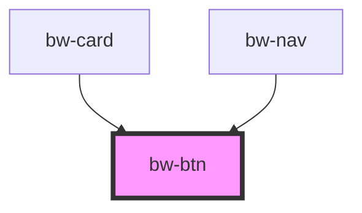

# bw-btn

<!-- Auto Generated Below -->

## Properties

| Property      | Attribute      | Description | Type     | Default     |
| ------------- | -------------- | ----------- | -------- | ----------- |
| `borderWidth` | `border-width` |             | `string` | `"2px"`     |
| `link`        | `link`         |             | `string` | `"#"`       |
| `name`        | `name`         |             | `string` | `"Name"`    |
| `radius`      | `radius`       |             | `string` | `"0px"`     |
| `size`        | `size`         |             | `string` | `"1.25rem"` |

## Events

| Event   | Description | Type                |
| ------- | ----------- | ------------------- |
| `press` |             | `CustomEvent<void>` |

## Dependencies

### Used by

 - [bw-card](../bw-card)
 - [bw-nav](../bw-nav)

### Graph

----------------------------------------------

*Built with [StencilJS](https://stenciljs.com/)*
