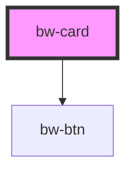

# bw-card

<!-- Auto Generated Below -->

## Properties

| Property                   | Attribute            | Description | Type       | Default     |
| -------------------------- | -------------------- | ----------- | ---------- | ----------- |
| `description` _(required)_ | `description`        |             | `string`   | `undefined` |
| `descriptionLength`        | `description-length` |             | `number`   | `200`       |
| `imgAlt` _(required)_      | `img-alt`            |             | `string`   | `undefined` |
| `imgSrc` _(required)_      | `img-src`            |             | `string`   | `undefined` |
| `link`                     | `link`               |             | `string`   | `'#'`       |
| `name` _(required)_        | `name`               |             | `string`   | `undefined` |
| `populate`                 | `populate`           |             | `boolean`  | `true`      |
| `showBtn`                  | `show-btn`           |             | `boolean`  | `true`      |
| `tagTitle`                 | `tag-title`          |             | `string`   | `'Tags:'`   |
| `tags` _(required)_        | --                   |             | `string[]` | `undefined` |

## Dependencies

### Depends on

- [bw-btn](../bw-btn)

### Graph

----------------------------------------------

*Built with [StencilJS](https://stenciljs.com/)*
