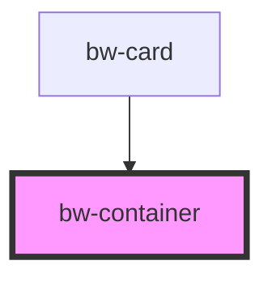

# bw-container

<!-- Auto Generated Below -->

## Properties

| Property       | Attribute       | Description | Type      | Default |
| -------------- | --------------- | ----------- | --------- | ------- |
| `border`       | `border`        |             | `string`  | `''`    |
| `center`       | `center`        |             | `boolean` | `false` |
| `flex`         | `flex`          |             | `boolean` | `false` |
| `grid`         | `grid`          |             | `boolean` | `false` |
| `mg`           | `mg`            |             | `string`  | `''`    |
| `mgH`          | `mg-h`          |             | `string`  | `''`    |
| `mgV`          | `mg-v`          |             | `string`  | `''`    |
| `pd`           | `pd`            |             | `string`  | `''`    |
| `pdH`          | `pd-h`          |             | `string`  | `''`    |
| `pdV`          | `pd-v`          |             | `string`  | `''`    |
| `primary`      | `primary`       |             | `boolean` | `false` |
| `radius`       | `radius`        |             | `string`  | `''`    |
| `radiusBottom` | `radius-bottom` |             | `string`  | `''`    |
| `radiusTop`    | `radius-top`    |             | `string`  | `''`    |
| `spaceBetween` | `space-between` |             | `boolean` | `false` |
| `split`        | `split`         |             | `boolean` | `false` |

## Slots

| Slot | Description      |
| ---- | ---------------- |
|      | The default slot |

## Dependencies

### Used by

 - [bw-card](../bw-card)

### Graph

----------------------------------------------

*Built with [StencilJS](https://stenciljs.com/)*
