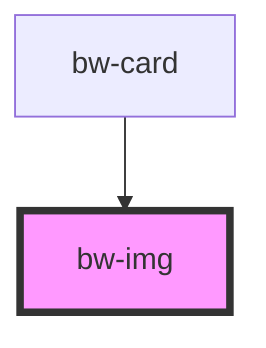

# bw-img

<!-- Auto Generated Below -->

## Properties

| Property              | Attribute       | Description | Type     | Default     |
| --------------------- | --------------- | ----------- | -------- | ----------- |
| `border`              | `border`        |             | `string` | `''`        |
| `height`              | `height`        |             | `string` | `"250px"`   |
| `imgAlt` _(required)_ | `img-alt`       |             | `string` | `undefined` |
| `imgSrc` _(required)_ | `img-src`       |             | `string` | `undefined` |
| `radius`              | `radius`        |             | `string` | `''`        |
| `radiusBottom`        | `radius-bottom` |             | `string` | `''`        |
| `radiusTop`           | `radius-top`    |             | `string` | `''`        |
| `width`               | `width`         |             | `string` | `"100%"`    |

## Dependencies

### Used by

 - [bw-card](../bw-card)

### Graph

----------------------------------------------

*Built with [StencilJS](https://stenciljs.com/)*
