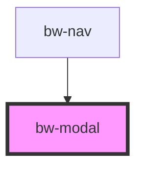

# bw-modal

<!-- Auto Generated Below -->

## Properties

| Property | Attribute | Description | Type      | Default |
| -------- | --------- | ----------- | --------- | ------- |
| `isOpen` | `is-open` |             | `boolean` | `false` |
| `name`   | `name`    |             | `string`  | `''`    |

## Events

| Event         | Description | Type                |
| ------------- | ----------- | ------------------- |
| `modalClosed` |             | `CustomEvent<void>` |

## Slots

| Slot | Description      |
| ---- | ---------------- |
|      | The default slot |

## Dependencies

### Used by

 - [bw-nav](../bw-nav)

### Graph

----------------------------------------------

*Built with [StencilJS](https://stenciljs.com/)*
