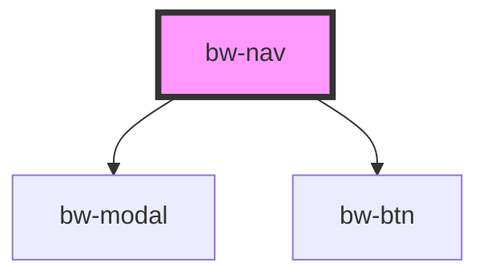

# bw-nav

<!-- Auto Generated Below -->

## Properties

| Property   | Attribute | Description | Type      | Default                                                                                                                                             |
| ---------- | --------- | ----------- | --------- | --------------------------------------------------------------------------------------------------------------------------------------------------- |
| `homeLink` | --        |             | `ILink`   | `{ name: 'Navbar', link: '#' }`                                                                                                                     |
| `mg`       | `mg`      |             | `string`  | `'0px'`                                                                                                                                             |
| `navLinks` | --        |             | `ILink[]` | `[     { name: 'Search', link: '#' },     { name: 'Manage', link: '#' },     { name: 'About', link: '#' },     { name: 'Profile', link: '#' },   ]` |
| `pd`       | `pd`      |             | `string`  | `'10px'`                                                                                                                                            |

## Dependencies

### Depends on

- [bw-modal](../bw-modal)
- [bw-btn](../bw-btn)

### Graph

----------------------------------------------

*Built with [StencilJS](https://stenciljs.com/)*
